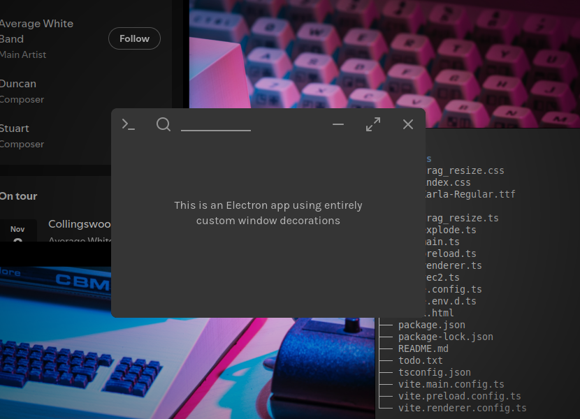

# Custom window example for Electron
***An example app showing how to make custom window decorations in Electron***

This is an example of an Electron app that has a custom titlebar as well as
cross-platform window resizing in a transparent window.
For resizing, it uses custom ("fake") resizing borders, implemented in
CSS & Javascript. This is necessary because Electron on Windows
does not support resizing
transparent windows.
On other operating systems the app uses OS-native
resizing, but the custom resize borders are still enabled because they don't get
in the way, in my experience.

For this example app, the window transparency is used to add
rounded corners to the window.

This example app only implements Windows-style window controls
(which are also pretty common on Linux).
The MacOS-style “traffic light” window controls are not included in this
example.
However, if you're handy with HTML & CSS
you can customize the provided window controls into MacOS-style
controls without too much work.
As it is, the example should *work* for all operating systems,
although it might not be appropriately styled.

Beware: Because Electron tells Windows that this app cannot be resized
(since it's transparent), you won't be able to use hotkeys like `Windows + Left`
to tile the window on the left side of the screen, and tiling the window by
dragging it to a side of the screen won't work either.
This should only be a problem on Windows, I can personally attest
that these things work fine on Linux.


## Usage

To run the app:
```shell
npm install  # Install the dependencies
npm start  # Run the app
```


## Directory structure

```
.
│  The root folder contains mostly configuration files for NPM, Electron Forge,
│  Vite and Typescript. Those files aren't very interesting.
│
├── README.md
│     The file you're reading right now!
├── LICENSE.md
│     Some copyright law stuff. You can freely use the example code.
├── index.html
│     The HTML of the app.
├── assets
│     This folder contains CSS files & fonts.
└── src
    ├── main.ts
    │     Electron's main process. Mainly creates the app's window and handles
    │     things like resizing the window.
    ├── preload.ts
    │     This script adds some functions that the renderer can later use to
    │     communicate with the main process.
    ├── renderer.ts
    │     Electron renderer. This code adds functionality to the HTML, such as
    │     making all of the window controls work. 
    ├── drag_resize.ts
    │     The logic for the custom window-resizing borders
    ├── explode.ts
    │     A completely unnecessary particle effect (for nice polish)
    └── vec2.ts
          A small custom 2D vector class, see "Vectors" section of README.md
```


## Vectors

In the code I make regular use of vectors and I thought it would be best to
clarify.

I have a bit of experience in game development and because of that I'm now
convinced that all Cartesian coordinates
(that is: all coordinates with some kind of `x` & `y` properties)
and differences in coordinates (such as size, offset and movement)
should pretty much always be stored in a
vector.
Notably, by "vector" I mean the linear algebra kind of vector, not the C++ kind
of vector.

Vectors let you turn most simple geometry operations into one-liners —
it's a lot more convenient than always working with `x` & `y`
individually.
Of course a whole linear algebra library is pretty overkill when I only
need a 2D vector, so I made my own small implementation and put it in
[src/vec2.ts](src/vec2.ts).

Here's how to calculate the distance between two points with vectors:
```js
const first_point = vec2(0.5, 0.5);
const second_point = vec2(5, 10);
// In the line below `sub` is short for "subtract" (which gives the difference
// between the two points). Unfortunately Javascript doesn't support custom 
// operator overloads, so we can't use the nicer "-" syntax :(
const distance = sub(first_point, second_point).length();
```
Here's the equivalent without vectors:
```js
const first_point = [0.5, 0.5];
const second_point = [5, 10];
const difference = [
    first_point[0] - second_point[0],
    first_point[1] - second_point[1]
];
// This is Pythagoras' theorem, for people who have forgotten their geometry:
const distance =
    Math.sqrt(difference[0]*difference[0] + difference[1]*difference[1]);
```
These two implementations internally do pretty much the same thing,
but the example with vectors just has nicer syntax (in my opinion).